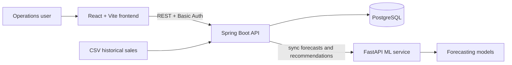

# DepotIQ Solution Architecture

## Problem and users

Retail teams must decide what to send from a central depot before stores run out of stock. DepotIQ combines historical sales, store inventory, depot availability, and demand forecasts to turn that decision into an auditable shipment recommendation.

Primary users are depot administrators, operations managers, and read-only stakeholders.

## End-to-end workflow

1. An administrator imports historical sales data or uses the seeded demo dataset.
2. The ML service produces store-product demand forecasts.
3. The backend combines demand, current inventory, incoming units, and a safety-stock buffer.
4. DepotIQ ranks recommendations by priority and presents a shipment quantity.
5. Operations users review, approve, plan, and track shipments.
6. Reports and forecasts provide visibility into demand coverage and operational risk.

## System overview

## Component responsibilities

| Component | Responsibility |
|---|---|
| React frontend | Dashboard, inventory, catalog, forecasts, shipments, reports, settings, and role-aware navigation. |
| Spring Boot backend | Validation, business rules, REST APIs, authentication/authorization, import handling, and shipment workflow. |
| PostgreSQL + Flyway | Persistent operational data, repeatable schema migrations, and deterministic demo seed data. |
| FastAPI ML service | Demand-model execution and the forecast/recommendation sync source. |

## Recommendation logic

For each store-product pair, the system considers:

- forecasted demand for the store planning horizon;
- store inventory already on hand;
- incoming store units;
- a safety-stock buffer; and
- depot inventory available for dispatch.

The backend stores an explanation with each recommendation so users can review the business context rather than treating the model output as a black box.

## Access model

| Role | Capabilities |
|---|---|
| Admin | Imports, catalog management, inventory updates, recommendations, shipment planning, and settings changes. |
| Manager | Inventory updates, recommendation review, and shipment planning. |
| Viewer | Read-only access to the operational dashboard, inventory, shipments, reports, and forecasts. |

Role checks are enforced by the backend. The frontend mirrors these permissions by showing only relevant pages and controls.

## Technology decisions

- **React + Vite** provides a fast, component-based UI for the operational workflow.
- **Spring Boot** provides typed REST APIs, validation, security configuration, and maintainable service boundaries.
- **PostgreSQL** fits structured inventory, sales, forecast, and shipment relationships.
- **Flyway** makes setup repeatable across developer machines and provides a consistent demo dataset.
- **Python/FastAPI with pandas and scikit-learn** keeps forecasting experimentation and API integration lightweight.

## Quality and maintainability

The repository separates frontend, backend, ML service, migrations, and documentation. Feature work is organized in focused branches with small commits. Backend tests and frontend production builds are run before pull requests.
